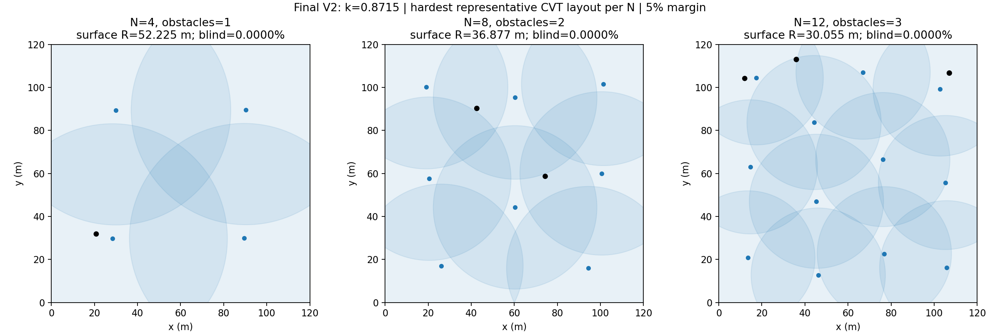

# Forward-Final Density-Normalized Sensing V2（2026-09-15）

## 交付结论与 Gate

基础 sensing 合同完成，`k=0.8715`。Frozen Coverage 迁移为 **COVERAGE_TRANSFER_BREAKS_POLICY**；静态 Reward-Balance 的最终预声明为 **alpha_capture=1.0**，实际 Full-Mix 训练流没有显示 capture gradient dominance。本轮未启动任何正式训练。

| 新实验 | 准备状态 | blocker |
|---|---|---|
| NormSense-PureCapture | READY；commit + push 后才可进入后续启动流程 | 无；不得抢占、停止或 resume OLD |
| NormSense-Original-FullMix | HOLD | MASTER 需裁决 Coverage V2 迁移破坏 |
| NormSense-RewardBalanced-FullMix | HOLD，建议取消 | 同上；alpha=1，与 Original 无实验差异 |

唯一机器 gate：[contracts.json](../artifacts/2026-09-15_normsense_v2/contracts.json)。READY 是合同就绪，不表示作业已启动。两个 Full-Mix 文件仍完整生成，不能将 alpha=1 的相同合同冒充有效 reward ablation。未自行启动 Coverage 重训；是否补训交由 MASTER。

## 仓库恢复与 OLD 隔离

起点与再次 fetch 的实验远端均为 `eb70d04`，主分支为 `experiment/small-step-ac-migration-20260828`。最近提交：`eb70d04/e696dec/d9ede24/c02f1ad`。原 worktree 的 supervisor 正在维护暂存 ledger/artifact，因此本交付在独立 checkout、独立分支 `experiment/density-normalized-sensing-v2-20260915` 完成并 push，不改变 OLD 的工作目录、索引、配置、checkpoint 或进程。

读取的权威材料包括实际 common/canonical YAML、Single-Task ledger、Pure-Coverage 最终 eval/checkpoint、Forward-Final scratch preflight、Full-Mix stream、Final IQN parity/sensing audit。物理 runtime 优先于文字描述。OLD Capture PID `827847`，tmux `cocap_single_task_20260915`，GPU0，观测到 step200000 checkpoint evaluation，预算仍为500k，结论未完成。结束时快照见 [MASTER](../artifacts/2026-09-15_normsense_v2/MASTER.json)。

已完成的 OLD Coverage200k 为 `PURE_COVERAGE_LEARNABLE`：argmax/sample 各20/20 strict CE、0碰撞。本次 Legacy 冻结重放的40局逐 seed 初态、成功/碰撞/长度、RMS/max/CV/return 与原200k记录完全相同，数值最大误差0。

## 唯一新默认入口与信息来源

新实验默认入口：[forward_final_v2.py](../src/cocap_voradj/training/forward_final_v2.py)，默认配置：[default.yaml](../configs/experiments/forward_final_normsense_v2_20260915/default.yaml)。旧模块和 YAML 保留 R20 历史复现语义；AGENTS 已明确禁止把这些 legacy 默认作为新实验起点。

- **Onboard**：敌人、障碍都由本机传感器直接探测，共用 `runtime_metadata(env)['resolved_onboard_radius']`；V2 拒绝独立 enemy/obstacle radius 字段。
- 两者严格采用 `center_distance - observer_radius - target_radius <= R`。不改历史实体形状、遮挡/全向规则或输入归一化方式；禁止 global enemy broadcast。真实 getter 也阻止通过 broadcast flag 绕过 resolver。
- **Friendly**：保持历史 global-friendly VorAdj/free_mask_projected 构图和邻居通信；没有实现“真正 local-friendly”。那是后续 V3，不能把 V2 描述为全链路局部信息。
- **Static geometry**：地图障碍 mask 是已知规划几何；显式 obstacle token 仍必须通过同一个 onboard surface sensor。保留历史 free-mask/centroid 提供的几何信息，不冒充仅由显式 tokens 构图。

本轮仅改变 dynamic onboard perception radius。相同标称 N 的 R 随已知静态 mask 解析，不随活跃无人机死亡数、训练 step、reward 或探测结果在线调节。

## Geometry 标定：真实 Final 1/2/3 障碍

`R = k sqrt(A_eff / N)`。这里 **R 本身是 surface-clearance 米数**，不是先求 center radius 再手工写 YAML。最小值以真实 `_vct_ls_surface_clearance` 对零半径 free-space 点的可见性判断获得；真实敌人/障碍各自带 target radius。

`A_eff = W H × mean(Final free_mask_projected)`：使用 runtime 60×60 网格、真实 robot radius、障碍位置/半径和原 `grid_margin`，不更改 CE mask。Final 三阶段地图均120×120；N=4/8/12，障碍数分别1/2/3，半径1–1.1。

- 每个 N 12 个固定 geometry seed（2026091501–2026091512），每个 seed 包含收敛 CVT 与 ±2% `sqrt(A_eff/N)` 位置扰动，共72组。
- 所有72组经真实 `_voradj_coverage_geometry(..., strict=True)` 检查，均满足 strict CE 几何；最大 area CV 随 N 为 .0301/.1028/.1422。不是仅检验理想方格。
- `k=.65…1.10`，步长 `.0025`；预声明 blind fraction ≤ `.001`，无孤立盘且 overlap 图全连通。最小通过 `k=.830`。
- 最终 `k=.830×1.05=.8715`。5%来自预声明的布局/离散化裕量，不是通过后随意加大到“全局可见”。随后独立使用241×241、0.5m网格验证，保留原物理障碍 inflation，全部盲区为0。
- 有限网格和代表布局是经验 gate，不声称任意失衡 swarm 或连续空间解析意义上永无盲区。

| N / 障碍数 | 参考 seed A_eff (m²) | runtime R (m) | 12 seeds R 范围 (m) | normalized R | 最坏细网格 blind | 平均 detector 数 | 孤立盘 |
|---|---:|---:|---|---:|---:|---:|---:|
| 4 / 1 | 14360 | 52.2173245 | 52.210051–52.224597 | .8715 | 0 | 1.6844 | 0 |
| 8 / 2 | 14324 | 36.8769126 | 36.856311–36.882061 | .8715 | 0 | 1.9292 | 0 |
| 12 / 3 | 14288 | 30.0720122 | 30.046745–30.076221 | .8715 | 0 | 2.0432 | 0 |

参考 seed=2026091501。每个 layout 的 overlap pairs、多重覆盖面积、完整 detector-count 分布、strict CE、resolved metadata 和整个 sweep 在 [geometry.json](../artifacts/2026-09-15_normsense_v2/geometry.json)。归一化半径与 blind/isolation 难度一致；有限边界导致平均 detector 数仍有约21%的4→12变化，不能宣称完全尺度不变。R4约为地图对角线的30.8%；真正可见性是否趋于全局另由 matched diagnostic 检查。



## 大 N 地图规则

物理 floor 暂定 **20m surface range**，来源为已存在的历史传感器下限；这是兼容/设计下限，不是硬件标定的最优值。4/8/12地图保持120×120。

令基础 free-space area 为 A0，`s=max(1, R_floor sqrt(N/A0)/k)`；`W=s W0, H=s H0, A_eff=s² A0, R=k sqrt(A_eff/N)`。超过 `N_floor=k² A0/R_floor²` 后扩地图而不继续缩 sensor；参考 A0=14360 时阈值约27.265，因此整数 N≥28触发。

[resolver](../src/cocap_voradj/envs/density_sensing.py) 输出 base/resolved map、area、scale、floor、threshold、N、k 与 surface semantics。该规划假设同一 free-space fraction；真正实例化放大地图/障碍后必须重新测量 mask 并调用 runtime resolver。若实际 R 低于 floor，runtime **报错**，不偷偷 clamp 掩盖地图不满足规则。尚未运行更大 N 实验；N64只作公式单元测试。

## Frozen Coverage@200k：80局完整 matched 评估

固定原200k Actor，无参数更新。20 seeds × argmax/sample × Legacy/V2，共80局，完整 horizon/native termination；每一对初态 fingerprint 相同。same-state counterfactual 只重算观测及 action distribution，不采额外动作，保持 rollout RNG。下表每项为 episode 等权均值；time-to-CE仅成功局，失败删失。

| mode/合同 | strict success | collision | CE RMS / max / CV | time-to-CE (s) | obstacle token/agent | 同状态 argmax disagreement |
|---|---:|---:|---|---:|---:|---:|
| argmax Legacy | 100% | 0% | .020757 / .033218 / .048594 | 83.35 | .06084 | 60.59% |
| argmax V2 | 10% | 75% | .129285 / .170504 / .193208 | 49.75（仅2局） | .36883 | 54.17% |
| sample Legacy | 100% | 0% | .024586 / .034732 / .067607 | 48.75 | .06363 | 51.63% |
| sample V2 | 100% | 0% | .040364 / .058129 / .074955 | 93.625 | .41752 | 54.94% |

单障碍下 occupancy=count mean。两种合同轨迹上的同状态 action probability total variation 分别约 .30–.33；不是把两条不同轨迹的动作直接做不合理比较。全部逐局数据、各模式配对差及5000次配对 bootstrap 区间见 [coverage_transfer.json](../artifacts/2026-09-15_normsense_v2/coverage_transfer.json)。

预声明 neutral：两模式 success降幅≤5pp、collision增幅≤5pp，RMS/max/CV及成功局time不超过1.15倍；usable：两模式success≥90%、collision≤10%；否则breaks。本次明确 **COVERAGE_TRANSFER_BREAKS_POLICY**。sample稳定并不能掩盖argmax大幅失效；argmax成功局time下降有严重幸存者偏差。旧 checkpoint 保留为 Legacy anchor，不能声称 V2 bit-equivalent。是否补 Pure-Coverage V2 由 MASTER 决定。

## Capture 探索诊断

50个独立 matched reset seeds，随机 AW9 motion，最多512步或native terminal。完全相同物理状态轨迹分别查询 R20/V2，避免策略反应混淆；APF、动作、spawn、物理不变。首次探测时刻含 reset t=0，未探测轨迹单列为删失，不记为完成时间。

| 指标 | Legacy | V2 |
|---|---:|---:|
| reset 至少一机可见 | 26% | 94% |
| 首次探测平均步（已探测轨迹） | 62.4468（47/50） | 3.08（50/50） |
| 首次探测P50/P90步 | 23 / 163.2 | 0 / 0 |
| 全段未探测轨迹 | 6% | 0% |
| pooled zero-detector steps | 63.653% | 5.277% |
| 全部4机同时可见 steps | 0% | 12.210% |
| obstacle token/agent（episode均值） | .10243 | .45940 |

V2 detector-count 分布0/1/2/3/4为 `[.052774,.192378,.362457,.270289,.122103]`。零 detector 暴露相对下降91.71%。大多数状态不是全机可见，未触发预声明 all-four≥50%的 global-visibility veto。这里证明探索信息更易获得，不证明捕获成功率或长期学习改进。[完整可见性报告](../artifacts/2026-09-15_normsense_v2/capture_visibility.json)。

## Reward-Balance：最终 alpha=1，建议取消重复臂

冻结强 Full-Task BC Actor（checkpoint SHA `7916a970226a0452a8f71a22235524f6ba4511aa4c9bda907a9c8368a60bf2cd`），使用同一真实 V2 Full-Mix mixed/coverage/recovery schedule，seed2026091401，16×256 joint steps。central V 是 canonical fresh random V，ValueNorm为初值；Actor/V/optimizer全程无更新，backbone梯度开放。它是静态 cold-critic PPO 预标定，不冒充训练后 critic 的归因。

按实际 transition `reward_role` 切 direct capture / support / coverage（含recovery和uninformed）。使用真实 `compute_gae`、terminal/truncation/bootstrap、gamma=.99/lambda=.95；每256窗口全 active rows 归一化 advantage。求 frozen behavior policy 下 ratio=1 的实际 clipped PPO policy surrogate 梯度；不混入entropy梯度，不裁剪，不经过Adam。各phase loss均除以**全窗口active行数**，保留真实phase占比。此处报告GAE target，不将有限段bootstrap target误叫完整episode MC。

| phase | sample rows | raw reward均值 | GAE target均值 | raw advantage均值 | normalized advantage均值 | mean policy-loss contribution |
|---|---:|---:|---:|---:|---:|---:|
| capture | 737 | 3.918562 | 47.155700 | 47.716829 | 1.778455 | −.0800001 |
| support | 270 | .028140 | 4.623310 | 5.281806 | −.056111 | .0009247 |
| coverage/recovery | 15377 | −.072190 | −1.114827 | −.686472 | −.084254 | .0790754 |

奖励/target/advantage列按agent-row加权，loss列为16窗口等权的全batch贡献。归一化 advantage 在ratio1时总loss接近0是代数结果，不代表其梯度为0。

### 保留缺席 phase 的真实零贡献

实际16窗口中 capture只出现6个、support只出现4个。仅挑同时含capture与coverage的6窗口，中位范数4.3854/2.1724、比值2.0187，会给出条件候选alpha=.495374；但它**排除了10个真实coverage窗口**。其描述性窗口bootstrap比例区间 `[.7901,3.4850]` 也跨过1，不能作为稳定dominance证据。

最终主统计使用全部16个实际PPO窗口的**10%对称截尾均值**，每尾去掉floor(16×.1)=1个，保留缺席phase的零贡献。选择理由：capture/support全窗口中位数为0；截尾均值保留其实际幅度与出现频率，并降低极端窗口影响，而不是挑选对缩放有利的窗口。

| phase | 全窗口median norm | 全窗口trimmed-mean norm | 平均梯度向量的norm |
|---|---:|---:|---:|
| capture | 0 | 1.363283 | .787915 |
| support | 0 | .079319 | .062749 |
| coverage | 4.865541 | 5.114967 | 1.942541 |

主 robust norm 比值 `||g_capture||/||g_coverage||=.266528`；聚合平均向量范数比`.405610`。两者均未显示真实Full-Mix流的capture dominance。

最终预声明：`alpha_capture=clip(5.11496678 / 1.36328291, .25, 1)=1.0`。因此Original与RewardBalanced配置完全相同，建议MASTER取消后者，**不强行设0.5**。条件候选缩放的固定rollout重算作为exploratory证据留档，明确不是训练预声明，也不是选择较好performance后的系数。

聚合Actor梯度cosine：capture↔coverage=`−.0019989539`；capture↔support=`.0282870633`；support↔coverage=`−.2256670478`。capture/coverage接近正交，不能称强负冲突。不同phase占比、单seed、冷critic以及窗口共享episode限制推断范围。

所有窗口的sample rows、raw reward、GAE target、raw/normalized advantage、policy loss、gradient norm、pairwise cosine、原始冻结batch SHA和重放核验见 [reward_balance.json](../artifacts/2026-09-15_normsense_v2/reward_balance.json)。局部原始batch `.pt`不进入Git。静态reward runtime已实现：direct capture、support capture、capture terminal ×同一alpha；support coverage、普通coverage及其terminal、safety/collision不缩放，拒绝在线改alpha。本次alpha1因此数值不变。

## 三合同 parity 与 manifest

Full-Mix A/B使用相同seed2026091401、全随机Actor/V、fresh ValueNorm、PPO、256 rollout、reset/recovery schedule、eval seeds（2026092401起）、确认eval seeds（2026102401起），`UNEXPLAINED=0`。Actor初始hash均`54f502a7…`，V均`10d13241…`；ValueNorm状态hash一致。alpha1时resolved配置零差异，不隐藏无效对照。

NormSense-PureCapture继承OLD common/canonical、seed2026091501、500k预算、25k评估、horizon3000、Final CR-MS/support和capture终止。Actor初始hash `96555364…`、V `a1b1c909…` 与OLD launch逐项断言一致，初态fingerprint回归相同。唯一配置差异是移除两个R20字段并增加统一V2 policy/schema/k/floor，`UNEXPLAINED=0`，无PPO/reward/horizon/spawn差异。

每份manifest记录policy/schema、k、resolved scalar、N、map/free area/mask SHA、distance semantics、离线blind metric和适用范围。没有手写center radius进YAML，也没有声称离线CVT盲区统计保证随机初态全覆盖。

## 复现与验证

在仓库根目录，以本地只读checkpoint路径运行：

```bash
python tools/calibrate_density_sensing_20260915.py
python tools/validate_normsense_geometry_20260915.py
python tools/report_normsense_geometry_20260915.py
# part=0,1,2,3 为独立进程，均只做冻结推理
CUDA_VISIBLE_DEVICES=1 python tools/diagnose_normsense_v2_20260915.py coverage --device cuda:0 --episodes 20 --part 0 --parts 4
python tools/summarize_normsense_coverage_20260915.py
python tools/diagnose_normsense_v2_20260915.py visibility --episodes 50
python tools/calibrate_reward_balance_20260915.py --windows 16
python tools/replay_normsense_gradients_20260915.py
python tools/prepare_normsense_contracts_20260915.py
```

所有本次诊断实际设置OMP/OPENBLAS线程数1，GPU推理仅GPU1；GPU0 OLD只读。Coverage脚本必须完成四个part后合并。冻结checkpoint存放在相邻历史worktree `cocap-voradj-small-step-ac`；迁移机器需恢复相同SHA资产，不允许替换为不同Actor。准备脚本没有正式训练入口。

CPU回归覆盖：4/8/12与真实1/2/3障碍、surface阈值、统一scalar、禁止独立字段/center距离/broadcast、floor与map scaling、direct/support/capture terminal缩放、coverage terminal/safety不变、在线alpha漂移拒绝、实际collector与新stream reset、历史single-task与transition语义。当前 **30 passed**；原200k冻结重放数值误差0。源码/产物校验见 [delivery manifest](../artifacts/2026-09-15_normsense_v2/delivery_manifest.json)。
