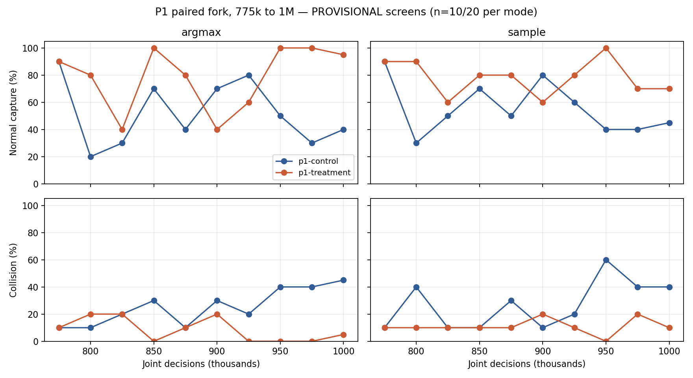

# Batch01 运行状态与结果快照

快照：2026-10-11T00:17:57.702032+08:00（Asia/Shanghai）。5条线完成授权预算与screen，0条训练进程仍在运行；全部属于`PROVISIONAL_LONG`。没有合格且尚未启动的已登记预算。另有1条线已完成训练预算，末点screen尚待完成。

科学candidate：`9cc2d47c532c76239a61a0f6a19c8603358c92bf`；canonical lock：`384b9ba587b905b879a08f01fa1073ca470bdc0a836459067d193d97b03a84ab`。`CORE_V3_SELFTEST_PASS / QA_PENDING / BASE_FREEZE_BLOCKED`。同一Commander执行A3独立编写的测试，不等于独立审核签字；正式RUNNING=0，不能追认为正式证据。

## 当前运行与checkpoint

| 线 | 状态 | 当前PID / GPU | step / 授权终点 | update | 最新checkpoint step |
|---|---|---|---|---:|---:|
| p1-control | PROVISIONAL预算与screen完成 | 已退出 | 1,000,000 / 1,000,000 | 3,920 | 1,000,000 |
| p1-treatment | PROVISIONAL预算与screen完成 | 已退出 | 1,000,000 / 1,000,000 | 3,920 | 1,000,000 |
| r1 | PROVISIONAL_LONG_COMPLETE_PENDING_SCREEN | 已退出 | 1,000,000 / 1,000,000 | 3,920 | 1,000,000 |
| n1 | PROVISIONAL预算与screen完成 | 已退出 | 1,000,000 / 1,000,000 | 3,920 | 1,000,000 |
| t1 | PROVISIONAL预算与screen完成 | 已退出 | 100,000 / 100,000 | 392 | 100,000 |
| c0 | PROVISIONAL预算与screen完成 | 已退出 | 1,000,000 / 1,000,000 | 3,920 | 1,000,000 |

R1训练进程已退出，预算与screen状态见上表。实际吞吐、完整checkpoint路径/hash、run_id、GPU UUID、历史PID、恢复回滚和异常详见[机器快照](../../artifacts/2026-10-09_terl_mappo_batch01/commander_v3r2/status_20261011/snapshot.json)与[run registry](../../artifacts/2026-10-09_terl_mappo_batch01/run_registry.json)。本次六个最新checkpoint及sidecar/manifest绑定、各ARM声明源码delta重新hash通过。

## 最新screen结果

以下是screen而非final，不能用于宣称总体优越性。表内为deterministic/sample；C0 deterministic为mean，其余为argmax。两个模式共享物理初态，不能把20+20当成40个独立seed。

| 线 | screen step | 每模式n | normal capture | collision |
|---|---:|---|---|---|
| p1-control | 1,000,000 | 20/20 | 40%/45% | 45%/40% |
| p1-treatment | 1,000,000 | 20/20 | 95%/70% | 5%/10% |
| r1 | 975,000 | 10/10 | 70%/80% | 30%/20% |
| n1 | 1,000,000 | 20/20 | 75%/75% | 25%/20% |
| t1 | 100,000 | 20/20 | 85%/55% | 15%/40% |
| c0 | 1,000,000 | 20/20 | 40%/40% | 10%/15% |

## Best-observed与保持曲线

best-observed按normal最高、collision最低、最早step记录，仅描述已观察screen，不生成selection receipt或promotion。n随预登记milestone为10或20，且多次观察存在选择偏差。

| 线 | 模式 | best screen step | n | normal capture | collision |
|---|---|---:|---:|---:|---:|
| p1-control | argmax | 775,000 | 10 | 90% | 10% |
| p1-control | sample | 775,000 | 10 | 90% | 10% |
| p1-treatment | argmax | 850,000 | 10 | 100% | 0% |
| p1-treatment | sample | 950,000 | 10 | 100% | 0% |
| r1 | argmax | 325,000 | 10 | 90% | 10% |
| r1 | sample | 750,000 | 20 | 95% | 5% |
| n1 | argmax | 325,000 | 10 | 100% | 0% |
| n1 | sample | 725,000 | 10 | 100% | 0% |
| t1 | argmax | 0 | 20 | 85% | 15% |
| t1 | sample | 25,000 | 20 | 70% | 20% |
| c0 | mean | 750,000 | 20 | 100% | 0% |
| c0 | sample | 750,000 | 20 | 70% | 15% |

P1两个分支已从同一775k完整状态配对到1M，live target KL分别0.02/0.01；末点treatment的normal capture高于control，属于本次单状态分叉的描述性结果。已覆盖775k之后全部25k screen点，同时保留best-observed与last，未创建selected/best promotion。



[全部六线screen曲线CSV](../../artifacts/2026-10-09_terl_mappo_batch01/commander_v3r2/status_20261011/screen_curves.csv)；[完整screen原件](../../artifacts/2026-10-09_terl_mappo_batch01/commander_v3r2/status_20261011/screens/)按字节归档，机器快照列出每线总评估量。逐episode物理初态及sample seed offset已验证配对一致。

## 启动与升级门禁

T1 Stage2 100k已经完成首个review窗口，不把100k解释为必然失败。末点screen sample normal55%、collision40%，尚低于升级目标normal≥80%、collision≤20%；正式升级还须selection域每模式20局的Stage2资格及Stage1 retention，并须独立QA/冻结BASE。现在缺少上述合格报告，且尚无Stage3 PROVISIONAL预算，因此不启动Stage3，也不自动扩Stage2到200k。其它五线按各自已授权终点处理，未新增同名run。

最终2076100900域保持盲态；screen2056100900、selection2066100900、sample offset100000、scene offsets0/1000/2000保持绑定，历史T0 final不变。

资源检查只在启动/排队时决定是否可开启新任务；监督器运行期RAM/GPU/磁盘/租约阈值均为告警，不杀停已启动训练。源码、checkpoint、预算、QA门禁继续保留。训练器自身锁定源码中的2GiB allocation/8GiB输出/30GiB磁盘检查未热改，当前未触发。两卡仍有受保护的外部任务；没有停止或修改外部PID。

## 云端与恢复入口

Core、QA及六ARM的本地HEAD与远程HEAD逐一一致；完整分支与SHA见机器快照。中央文档、原始screen证据、曲线、资源恢复回执与DAG/run registry随本轮commit推送GitHub。checkpoint权重保留在服务器，仅同步路径/hash，不将大体积权重伪称已上传云端。

```bash
cd /home/yjq/rl/CoCap1/ac-master-dag-20260921
python tools/batch01_status.py --current
python tools/batch01_status.py --write --json
python tools/batch01_report.py
```

持久监督器tmux：`batch01_commander_v3r2_long_supervisor`；恢复队列：`batch01_commander_resource_recovery`。CLI断连后可从中央registry、每run progress/manifest及runtime heartbeat恢复。NEXT WAKE-UP：R1末点screen完成，或独立同SHA/lock QA签字到达；完成预算的线不自动续训。
